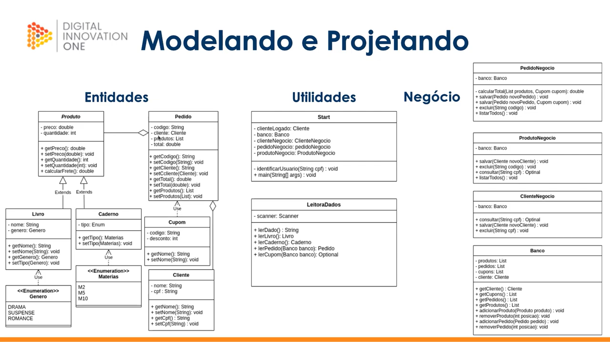

# ⚗️ Labotório OO Java

Projeto de prática do LabOO Java da DIO. Tem como objetivo praticar o paradigma de orientação a objetos.

## 🧾 Modelo do Projeto - UML

## 🛠️ Tecnologias

- `Java`
- `Git`

## ✅ Funcionalidades implementadas

> Package entidade - class Produto
- [x] Criar método de cálculo de frete;

> Package entidade - class Pedido
- [x] Preencher classe Pedido;

> Package negocio - class PedidoNegocio
- [x] Implementado método salvar pedido;

## 🎯 Desafios propostos

> Package entidade - class Caderno
- [x] Criado classe Caderno;

> Package constantes - class Materias
- [x] Criado classe Materias;

> Package console - class Start
>> Criar funcionalidade para...
  - [ ] Consultar Caderno mediante matéria;
  - [ ] Consultar Pedido pelo código;
  - [ ] Cadastrar Caderno;
  - [ ] Excluir Caderno;
  - [x] Listar todos os Pedidos;

> Package negocio - class PedidoNegocio
  - [x] Criar funcionalidade para listar todos os pedidos;

> Package negocio - class ProdutoNegocio
>> Criar funcionalidade para...
  - [x] Realizar comparação de produto utilizando equals;
  - [x] Excluir produtos mediante código;

> Package utilidade - class LeitoraDados
  - [ ] Criar funcionalidade para ler o caderno;